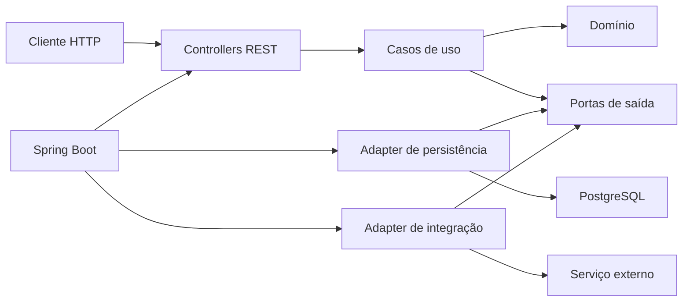
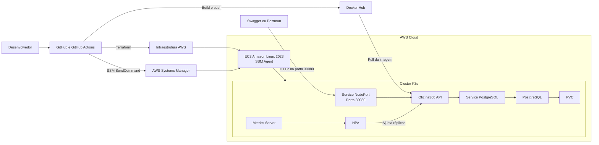
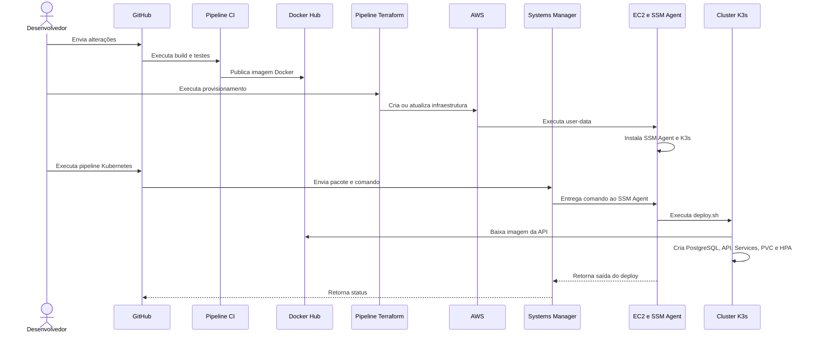
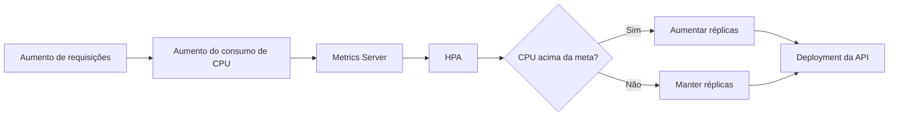

# Oficina360 API

API REST para gerenciamento de oficinas mecânicas, desenvolvida no Tech Challenge da Pós-Graduação em Arquitetura de Software.

O Oficina360 contempla o ciclo de atendimento de uma oficina, desde o cadastro de clientes e veículos até a abertura, o diagnóstico, a aprovação do orçamento, a execução e a finalização de ordens de serviço. A solução também inclui controle de estoque, autenticação, autorização, persistência de dados, observabilidade, automação de infraestrutura e escalabilidade horizontal.

---

## Sumário

- [Sobre o projeto](#sobre-o-projeto)
- [Objetivos da Fase 2](#objetivos-da-fase-2)
- [Funcionalidades](#funcionalidades)
- [Arquitetura da solução](#arquitetura-da-solução)
- [Tecnologias utilizadas](#tecnologias-utilizadas)
- [Estrutura do projeto](#estrutura-do-projeto)
- [Documentação das APIs](#documentação-das-apis)
- [Execução local](#execução-local)
- [Execução com Docker Compose](#execução-com-docker-compose)
- [Provisionamento com Terraform](#provisionamento-com-terraform)
- [Deploy no Kubernetes](#deploy-no-kubernetes)
- [CI/CD](#cicd)
- [Escalabilidade automática](#escalabilidade-automática)
- [Segurança](#segurança)
- [Observabilidade](#observabilidade)
- [Testes e qualidade](#testes-e-qualidade)
- [Documentação complementar](#documentação-complementar)
- [Limitações do ambiente acadêmico](#limitações-do-ambiente-acadêmico)

---

## Sobre o projeto

O **Oficina360** é uma API REST criada para apoiar os principais processos de uma oficina mecânica.

A aplicação oferece recursos para:

- cadastro e gestão de clientes;
- cadastro e gestão de veículos;
- cadastro e gestão de serviços;
- controle de peças, insumos e reservas de estoque;
- abertura e acompanhamento de ordens de serviço;
- diagnóstico técnico;
- aprovação ou recusa de orçamento;
- execução e finalização dos serviços;
- autenticação e autorização baseadas em JWT;
- indicadores operacionais;
- documentação e exploração das APIs;
- monitoramento da saúde da aplicação.

O projeto utiliza práticas e tecnologias relacionadas a:

- Domain-Driven Design;
- Clean Architecture;
- Clean Code;
- testes automatizados;
- segurança e controle de acesso;
- observabilidade;
- conteinerização com Docker;
- orquestração com Kubernetes e K3s;
- infraestrutura como código com Terraform;
- computação em nuvem com AWS;
- integração e entrega contínuas com GitHub Actions;
- escalabilidade horizontal com Horizontal Pod Autoscaler;
- documentação arquitetural com o Modelo C4.

---

## Objetivos da Fase 2

A Fase 2 teve como objetivo evoluir a aplicação desenvolvida na fase anterior, incorporando práticas modernas de arquitetura, infraestrutura e automação.

As principais evoluções realizadas foram:

- refatoração da aplicação com base nos princípios da Clean Architecture;
- separação das regras de negócio dos frameworks e detalhes de infraestrutura;
- manutenção e ampliação dos testes automatizados;
- revisão do Dockerfile e do Docker Compose;
- criação dos manifests Kubernetes;
- implantação da API e do PostgreSQL em um cluster K3s;
- configuração de Namespace, ConfigMap, Secret, Services, PVC e HPA;
- provisionamento da infraestrutura AWS com Terraform;
- instalação automática do K3s na EC2 por meio de `user-data`;
- execução remota do deploy pelo AWS Systems Manager;
- automação de build, testes, imagem Docker e deploy com GitHub Actions;
- implementação de escalabilidade horizontal baseada no consumo de CPU;
- utilização de um backend remoto para o Terraform State.

A descrição detalhada da evolução está disponível em:

- [Evolução da Fase 2](docs/FASE_2.md)

---

## Funcionalidades

### Clientes

- cadastrar cliente;
- listar clientes;
- buscar cliente por documento;
- atualizar cliente;
- excluir cliente.

### Veículos

- cadastrar veículo;
- listar veículos;
- buscar veículo por placa;
- atualizar veículo;
- excluir veículo;
- vincular veículo ao cliente.

### Serviços

- cadastrar serviço;
- listar serviços;
- buscar serviço;
- atualizar serviço;
- excluir serviço;
- calcular tempo médio de execução.

### Estoque

- cadastrar item;
- listar itens;
- buscar item;
- atualizar item;
- excluir item;
- reservar quantidade;
- controlar a disponibilidade de peças e insumos.

### Ordens de serviço

- abrir ordem de serviço;
- retornar a identificação única da ordem;
- consultar ordem de serviço;
- consultar status;
- executar diagnóstico técnico;
- adicionar serviços e peças ao diagnóstico;
- aprovar orçamento;
- recusar orçamento;
- iniciar execução;
- finalizar execução;
- registrar indicadores operacionais;
- listar ordens conforme prioridade e antiguidade.

### Fluxo da ordem de serviço

```text
RECEBIDA
    |
    v
EM_DIAGNOSTICO
    |
    v
AGUARDANDO_APROVACAO
    |
    +--> REPROVADA
    |
    +--> APROVADA
            |
            v
       EM_EXECUCAO
            |
            v
        FINALIZADA
            |
            v
         ENTREGUE
```

---

## Arquitetura da solução

O Oficina360 continua sendo uma aplicação monolítica, porém sua estrutura interna foi refatorada com base nos princípios da Clean Architecture.

A aplicação está organizada em:

- **Domínio:** entidades, regras de negócio, objetos de valor, enums, exceções e contratos;
- **Casos de uso:** coordenação dos fluxos e operações da aplicação;
- **Frameworks e adapters:** controllers REST, Spring Boot, segurança, persistência, configurações e integrações externas.

A principal regra arquitetural é que o domínio não depende diretamente do Spring Boot, JPA, PostgreSQL ou de outros detalhes externos.



### Arquitetura da Fase 2



Documentação completa:

- [Arquitetura da Solução](docs/ARQUITETURA.md)
- [Evolução da Fase 2](docs/FASE_2.md)
- [Documentação do Terraform](docs/TERRAFORM.md)

---

## Domain-Driven Design

A modelagem do domínio utiliza conceitos de Domain-Driven Design para representar os processos da oficina por meio da linguagem do negócio.

### Artefatos produzidos

- Domain Storytelling;
- Linguagem Ubíqua;
- classificação dos subdomínios;
- Context Map;
- Event Storming;
- Modelo C4.

### Core Domain

- Ordem de Serviço.

### Supporting Domains

- Cliente Context;
- Veículo Context;
- Serviço Context;
- Estoque Context.

Mais detalhes:

- [Arquitetura da Solução](docs/ARQUITETURA.md)
- [Linguagem Ubíqua](docs/requisitos/LINGUAGEM-UBIQUA.md)

---

## Tecnologias utilizadas

### Backend

- Java 21;
- Spring Boot;
- Spring Web MVC;
- Spring Data JPA;
- Spring Security;
- JWT;
- PostgreSQL;
- H2 Database;
- Flyway.

### Arquitetura e documentação

- Clean Architecture;
- Domain-Driven Design;
- Swagger e OpenAPI;
- Structurizr DSL;
- Modelo C4;
- Domain Storytelling;
- Event Storming.

### Testes e qualidade

- JUnit 5;
- Mockito;
- JaCoCo;
- SonarCloud.

### Segurança

- Spring Security;
- JWT;
- OWASP Dependency Check;
- Dependabot;
- Snyk.

### Infraestrutura e DevOps

- Docker;
- Docker Compose;
- Docker Hub;
- Kubernetes;
- K3s;
- Terraform;
- GitHub Actions;
- AWS EC2;
- AWS VPC;
- AWS Systems Manager;
- Amazon S3;
- Horizontal Pod Autoscaler;
- Metrics Server;
- containerd.

---

## Estrutura do projeto

> A árvore abaixo deve permanecer alinhada aos pacotes e arquivos existentes no repositório.

```text
.
├── src/
│   ├── main/
│   │   ├── java/
│   │   │   └── com/techchallenger/oficina360/
│   │   │       ├── domain/
│   │   │       ├── usecases/
│   │   │       └── frameworks/
│   │   └── resources/
│   │       ├── application.yml
│   │       └── db/
│   │           └── migration/
│   └── test/
├── k8s/
│   ├── 1-namespace.yaml
│   ├── 3-configmap.yaml
│   ├── 5-postgres-pvc.yaml
│   ├── 6-postgres-service.yaml
│   ├── 7-postgres-deployment.yaml
│   ├── 8-api-deployment.yaml
│   ├── 9-api-service.yaml
│   ├── 10-hpa.yaml
│   └── deploy.sh
├── infra/
├── docs/
├── .github/
│   └── workflows/
├── Dockerfile
├── docker-compose.yml
├── pom.xml
└── README.md
```

---

## Documentação das APIs

### Swagger

Com execução Maven:

```text
http://localhost:8080/swagger-ui/index.html
```

Com Docker Compose:

```text
http://localhost:18080/swagger-ui/index.html
```

No ambiente AWS:

```text
http://IP_PUBLICO_DA_EC2:30080/swagger-ui/index.html
```

A documentação OpenAPI apresenta:

- endpoints;
- DTOs;
- autenticação JWT;
- exemplos de payloads;
- parâmetros;
- respostas;
- códigos HTTP.

### Postman

A collection completa das APIs disponível em:

- [Collection Postman do Oficina360](docs/postman/Oficina360.postman_collection.json)

Caso seja utilizado um arquivo de ambiente:

- [Environment Postman do Oficina360](docs/postman/Oficina360.postman_environment.json)


---

## Execução local

### Pré-requisitos

- Java 21;
- Maven ou Maven Wrapper;
- Docker;
- Docker Compose;
- Git.

### Clonar o projeto

```bash
git clone https://github.com/michaelhion/tech_challenge_pos_arquitetura_de_software.git
cd tech_challenge_pos_arquitetura_de_software
```

### Executar com Maven

Linux ou macOS:

```bash
./mvnw spring-boot:run
```

Windows:

```cmd
mvnw.cmd spring-boot:run
```

A execução direta da aplicação requer que as variáveis e dependências do ambiente estejam configuradas.

---

## Execução com Docker Compose

Inicie a API e o PostgreSQL:

```bash
docker compose up --build -d
```

Consulte o estado dos containers:

```bash
docker compose ps
```

Acompanhe os logs:

```bash
docker compose logs -f
```

Encerre o ambiente:

```bash
docker compose down
```

Para remover também os volumes locais:

```bash
docker compose down --volumes
```

### Acessos locais

API:

```text
http://localhost:18080
```

Swagger:

```text
http://localhost:18080/swagger-ui/index.html
```

Health check:

```text
http://localhost:18080/actuator/health
```

> Ajuste a porta caso o `docker-compose.yml` utilize um mapeamento diferente.

---

## Autenticação e login

A aplicação utiliza autenticação baseada em JWT.

### Fluxo de autenticação

1. o usuário realiza login com e-mail e senha;
2. a API valida as credenciais;
3. um token JWT é gerado;
4. o token é enviado nas requisições aos recursos protegidos.

Header esperado:

```http
Authorization: Bearer <token>
```

### Perfis de acesso

#### ADMIN

Possui acesso administrativo à aplicação.

#### CLIENTE

Possui acesso aos recursos permitidos e associados à própria conta.

### Credenciais de desenvolvimento

> As credenciais abaixo são fictícias e destinadas exclusivamente ao ambiente local e à demonstração acadêmica. Não devem ser reutilizadas em ambientes reais.

Administrador:

```json
{
  "email": "admin@oficina360.com",
  "senha": "123456"
}
```

Cliente:

```json
{
  "email": "cliente@oficina360.com",
  "senha": "123456"
}
```

---

## Provisionamento com Terraform

Os scripts de infraestrutura estão disponíveis em:

```text
infra/
```

O Terraform reutiliza alguns recursos fornecidos pelo ambiente acadêmico e cria ou configura os componentes necessários para hospedar o cluster K3s.

### Recursos fornecidos pelo ambiente acadêmico

- VPC;
- subnet;
- Internet Gateway;
- AMI Amazon Linux 2023;
- `LabInstanceProfile`.

### Recursos criados ou configurados pelo Terraform

- Route Table pública;
- rota de saída para o Internet Gateway;
- associação entre a Route Table e a subnet;
- Security Group;
- instância EC2;
- associação do Instance Profile;
- envio e execução do `user-data.sh`;
- backend remoto do Terraform State.

### Bootstrap da EC2

O `user-data.sh` é responsável por:

- validar o sistema operacional;
- habilitar o AWS Systems Manager Agent;
- configurar swap;
- instalar o K3s;
- iniciar o serviço K3s;
- aguardar a API do Kubernetes;
- validar o nó do cluster.

### Pré-requisitos

- Terraform;
- AWS CLI;
- credenciais AWS válidas;
- valores da VPC, subnet, Internet Gateway e AMI do laboratório.

### Inicializar

```bash
terraform -chdir=infra init -reconfigure
```

### Formatar

```bash
terraform -chdir=infra fmt -recursive
```

### Validar

```bash
terraform -chdir=infra validate
```

### Gerar o plano

```bash
terraform -chdir=infra plan -input=false
```

### Aplicar

O provisionamento deve ser executado preferencialmente pela pipeline Terraform do GitHub Actions.

Para uma execução manual controlada:

```bash
terraform -chdir=infra apply -input=false
```

### Remover os recursos

```bash
terraform -chdir=infra destroy -input=false
```

### Terraform State

O Terraform State registra o vínculo entre o código Terraform e os recursos reais da AWS.

A execução local e a pipeline devem utilizar o mesmo backend. Executar `apply` com states diferentes pode criar recursos órfãos ou duplicados.

Não edite nem remova manualmente o state enquanto os recursos correspondentes existirem.

Documentação detalhada:

- [Documentação do Terraform](docs/TERRAFORM.md)

---

## Deploy no Kubernetes

A API e o PostgreSQL são executados em um cluster K3s de nó único hospedado em uma instância EC2.

Os manifests estão disponíveis em:

```text
k8s/
```

### Recursos Kubernetes

- Namespace `oficina360`;
- Secret gerado dinamicamente pela pipeline;
- ConfigMap;
- PersistentVolumeClaim do PostgreSQL;
- Deployment e Service do PostgreSQL;
- Deployment e Service da API;
- Horizontal Pod Autoscaler;
- Metrics Server nativo do K3s.

O PostgreSQL é acessível somente dentro do cluster por meio de um Service do tipo `ClusterIP`.

A API é exposta por um Service do tipo `NodePort`:

```text
Porta da aplicação: 8080
NodePort: 30080
```

### Deploy automatizado

O deploy na AWS é realizado pela pipeline Kubernetes do GitHub Actions.

A pipeline:

1. valida os arquivos do deploy;
2. valida os GitHub Secrets;
3. localiza a EC2;
4. aguarda o SSM Agent ficar disponível;
5. gera o Secret temporário;
6. empacota os manifests e o `deploy.sh`;
7. envia o pacote pelo AWS Systems Manager;
8. executa o `deploy.sh` dentro da EC2;
9. implanta o PostgreSQL e aguarda seu rollout;
10. implanta a API e aguarda seu rollout;
11. cria os Services, o PVC e o HPA;
12. apresenta o estado dos recursos.

### Deploy manual

Em um cluster Kubernetes configurado:

```bash
chmod +x k8s/deploy.sh
./k8s/deploy.sh
```

Para a execução manual, é necessário criar previamente um `secret.yaml` válido ou criar o Secret diretamente no cluster.

### Validar o ambiente

Em um cluster Kubernetes convencional:

```bash
kubectl get pods -n oficina360
kubectl get deployments -n oficina360
kubectl get services -n oficina360
kubectl get pvc -n oficina360
kubectl get hpa -n oficina360
```

No K3s da EC2:

```bash
sudo k3s kubectl get pods -n oficina360
sudo k3s kubectl get deployments -n oficina360
sudo k3s kubectl get services -n oficina360
sudo k3s kubectl get pvc -n oficina360
sudo k3s kubectl get hpa -n oficina360
```

### Acesso na AWS

API:

```text
http://IP_PUBLICO_DA_EC2:30080
```

Swagger:

```text
http://IP_PUBLICO_DA_EC2:30080/swagger-ui/index.html
```

Health check:

```text
http://IP_PUBLICO_DA_EC2:30080/actuator/health
```

---

## CI/CD

O projeto utiliza GitHub Actions para integração contínua, provisionamento da infraestrutura e entrega da aplicação.

### Pipeline de integração contínua

Executada em pushes e pull requests:

```text
Build
    |
    v
Testes automatizados
    |
    v
JaCoCo e cobertura
    |
    v
Análise de dependências
    |
    v
SonarCloud
    |
    v
Build da imagem Docker
    |
    v
Publicação no Docker Hub
```

### Pipeline Terraform

Executada manualmente:

```text
Terraform init
    |
    v
Terraform validate
    |
    v
Terraform plan
    |
    +--> apply
    |
    +--> destroy
    |
    v
Atualização do Terraform State
```

### Pipeline Kubernetes

Executada após o provisionamento:

```text
Localizar a EC2
    |
    v
Aguardar o Systems Manager
    |
    v
Preparar manifests e Secret
    |
    v
Enviar pacote pelo SSM
    |
    v
Executar deploy.sh no K3s
    |
    v
Validar PostgreSQL, API, PVC, Services e HPA
```

### Fluxo completo



Dashboard de qualidade:

- [Projeto no SonarCloud](https://sonarcloud.io/summary/overall?id=michaelhion_tech_challenge_pos_arquitetura_de_software)

---

## Escalabilidade automática

A API utiliza Horizontal Pod Autoscaler baseado no consumo de CPU.

Configuração do ambiente acadêmico:

```text
Mínimo de réplicas: 1
Máximo de réplicas: 2
Meta de utilização de CPU: 70%
```

O Metrics Server coleta as métricas de CPU. O HPA compara a utilização atual com a meta configurada e ajusta a quantidade de réplicas do Deployment `oficina360-api`.

O HPA aumenta a quantidade de Pods da aplicação. O HPA não cria novas instâncias EC2.

### Consultar métricas

```bash
sudo k3s kubectl top nodes
sudo k3s kubectl top pods -n oficina360
```

### Acompanhar o HPA

```bash
sudo k3s kubectl get hpa -n oficina360 --watch
```

### Acompanhar os Pods

```bash
sudo k3s kubectl get pods -n oficina360 --watch
```

### Fluxo de escalabilidade



---

## Segurança

A aplicação utiliza autenticação baseada em JWT e controle de autorização por perfil e propriedade dos recursos.

### Exemplos de autorização

- clientes podem consultar as próprias ordens de serviço;
- clientes podem consultar os próprios veículos;
- clientes podem aprovar os próprios orçamentos;
- clientes não podem consultar dados de outras contas;
- clientes não podem aprovar orçamentos de outras contas.

### Ferramentas e práticas

- Spring Security;
- JWT;
- OWASP Dependency Check;
- Dependabot;
- SonarCloud;
- Snyk;
- GitHub Secrets;
- Kubernetes Secrets;
- AWS Systems Manager;
- ausência de chave SSH na pipeline;
- ausência de kubeconfig no GitHub Actions;
- dados sensíveis fora do repositório.

### Segurança da infraestrutura

O deploy Kubernetes utiliza o AWS Systems Manager em vez de SSH.

```text
GitHub Actions
    |
    | ssm:SendCommand
    v
AWS Systems Manager
    |
    v
SSM Agent na EC2
    |
    v
deploy.sh
    |
    v
sudo k3s kubectl
```

Essa estratégia evita a exposição pública da API do Kubernetes e reduz a necessidade de credenciais administrativas no pipeline.

---

## Observabilidade

A aplicação possui logs estruturados de requisições e respostas HTTP.

Informações registradas:

- Request ID;
- método HTTP;
- URI;
- usuário autenticado;
- tempo de resposta;
- status HTTP;
- payload sanitizado.

### Proteção de dados sensíveis

Campos protegidos:

- CPF;
- CNPJ;
- senhas;
- tokens JWT.

Exemplo:

```json
{
  "senha": "***"
}
```

O Spring Boot Actuator disponibiliza endpoints de saúde utilizados pelas probes Kubernetes:

```text
/actuator/health
/actuator/health/liveness
/actuator/health/readiness
```

---

## Banco de dados

Banco principal:

```text
PostgreSQL
```

Banco utilizado em testes específicos:

```text
H2 Database
```

### Migrações

As migrações são controladas pelo Flyway e estão localizadas em:

```text
src/main/resources/db/migration
```

No Kubernetes, o PostgreSQL utiliza:

- Deployment;
- Service ClusterIP;
- Secret;
- PersistentVolumeClaim;
- StorageClass `local-path`.

---

## Testes e qualidade

### Executar testes

```bash
./mvnw test
```

### Executar build completo

```bash
./mvnw clean verify
```

### Cobertura

A cobertura é monitorada por:

- JaCoCo;
- SonarCloud.

Meta do projeto:

```text
Cobertura mínima de 80%
```

### Métricas monitoradas

- bugs;
- vulnerabilidades;
- Security Hotspots;
- cobertura de testes;
- Code Smells;
- duplicação de código;
- manutenibilidade.

---

## Controle de estoque

Durante o diagnóstico:

- serviços podem ser adicionados à ordem;
- peças e insumos podem ser associados;
- itens do estoque são reservados automaticamente.

Exemplo:

```text
Quantidade total: 20
Quantidade reservada: 5
Quantidade disponível: 15
```

Cálculo:

```text
Disponível = quantidade total - quantidade reservada
```

---

## Indicadores operacionais

Ao finalizar uma ordem de serviço:

- o tempo total de execução é calculado;
- o histórico é armazenado;
- o sistema calcula o tempo médio dos serviços executados.

Esses dados auxiliam no planejamento operacional, no controle de produtividade e na geração de estimativas futuras.

---

## Tratamento de erros

A API utiliza tratamento global de exceções.

Principais exceções:

- `RecursoNaoEncontradoException`;
- `RegraDeNegocioException`;
- `ConflitoException`;
- `AccessDeniedException`.

Exemplo:

```json
{
  "status": 404,
  "erro": "Recurso não encontrado",
  "mensagem": "Cliente não encontrado"
}
```

---

## Funcionalidades implementadas

### Aplicação

- [x] CRUD de clientes;
- [x] CRUD de veículos;
- [x] CRUD de serviços;
- [x] CRUD de estoque;
- [x] reserva de estoque;
- [x] autenticação JWT;
- [x] controle de acesso por perfil;
- [x] controle de propriedade;
- [x] abertura de ordem de serviço;
- [x] consulta de status;
- [x] diagnóstico técnico;
- [x] aprovação de orçamento;
- [x] recusa de orçamento;
- [x] execução de serviços;
- [x] finalização de ordem de serviço;
- [x] cálculo de tempo médio;
- [x] Flyway;
- [x] Swagger e OpenAPI.

### Arquitetura e qualidade

- [x] Clean Architecture;
- [x] testes automatizados;
- [x] JaCoCo;
- [x] SonarCloud;
- [x] OWASP Dependency Check;
- [x] Dependabot;

### Infraestrutura e automação

- [x] Docker;
- [x] Docker Compose;
- [x] imagem no Docker Hub;
- [x] manifests Kubernetes;
- [x] PostgreSQL no K3s;
- [x] PVC;
- [x] ConfigMap e Secret;
- [x] Service NodePort;
- [x] HPA;
- [x] Terraform;
- [x] EC2 com K3s;
- [x] deploy por AWS Systems Manager;
- [x] pipelines no GitHub Actions.

---

## Documentação complementar

| Documento                                                                     | Descrição                                       |
|-------------------------------------------------------------------------------|-------------------------------------------------|
| [FASE_2.md](docs/FASE_2.md)                                                   | Evolução arquitetural, Kubernetes, AWS e CI/CD  |
| [ARQUITETURA.md](docs/ARQUITETURA.md)                                         | DDD, Modelo C4 e detalhes arquiteturais         |
| [TERRAFORM.md](docs/TERRAFORM.md)                   | Infraestrutura AWS e Terraform                  |
| [Documento de Requisitos](docs/requisitos/Documento_Requisitos_Oficina360.md) | Requisitos funcionais e regras de negócio       |
| [Linguagem Ubíqua](docs/requisitos/LINGUAGEM-UBIQUA.md)                       | Termos utilizados no domínio                    |
| [docs/ddd/](docs/ddd)                                                         | Artefatos de Domain-Driven Design               |
| [docs/c4/](docs/c4)                                                           | Diagramas e fontes do Modelo C4                 |
| [docs/security/](docs/security/)                                              | Evidências e relatórios de segurança como owasp |
| [docs/postman/](docs/postman)                                                 | Collection e ambiente das APIs                  |
---

## Limitações do ambiente acadêmico

A solução foi implementada em um ambiente acadêmico que possui algumas limitações:

- credenciais AWS temporárias;
- recursos IAM fornecidos pelo laboratório;
- VPC e subnet previamente existentes;
- cluster K3s de nó único;
- capacidade computacional limitada da EC2;
- PostgreSQL executado dentro do cluster;
- volume persistente associado ao nó;
- limite reduzido de réplicas da API;
- ausência de alta disponibilidade entre nós;
- IP público sujeito a alteração após a recriação da EC2.

Embora o HPA aumente a quantidade de Pods da API, todos os Pods são executados na mesma EC2.

Para um ambiente produtivo, poderiam ser adotados:

- Amazon EKS;
- cluster com múltiplos nós e zonas;
- Amazon RDS for PostgreSQL;
- volumes Amazon EBS;
- Application Load Balancer;
- HTTPS e certificados gerenciados;
- AWS Secrets Manager;
- políticas IAM de menor privilégio;
- observabilidade centralizada;
- backup automatizado;
- tags imutáveis para imagens Docker.

---

## Autor

Projeto desenvolvido para fins acadêmicos no contexto do Tech Challenge da Pós-Graduação em Arquitetura de Software.
