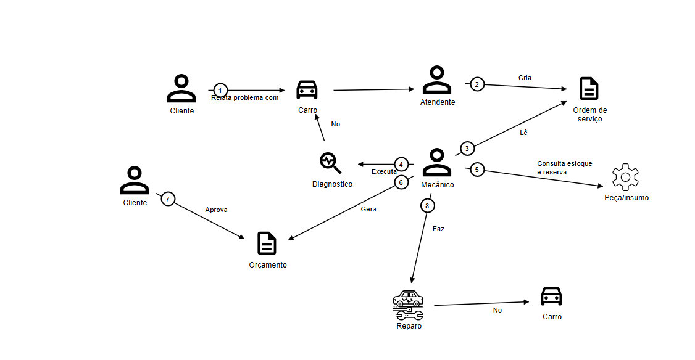
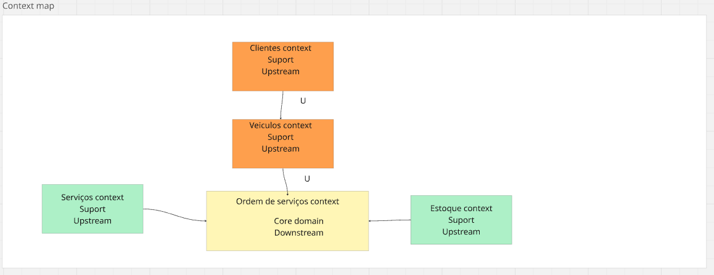
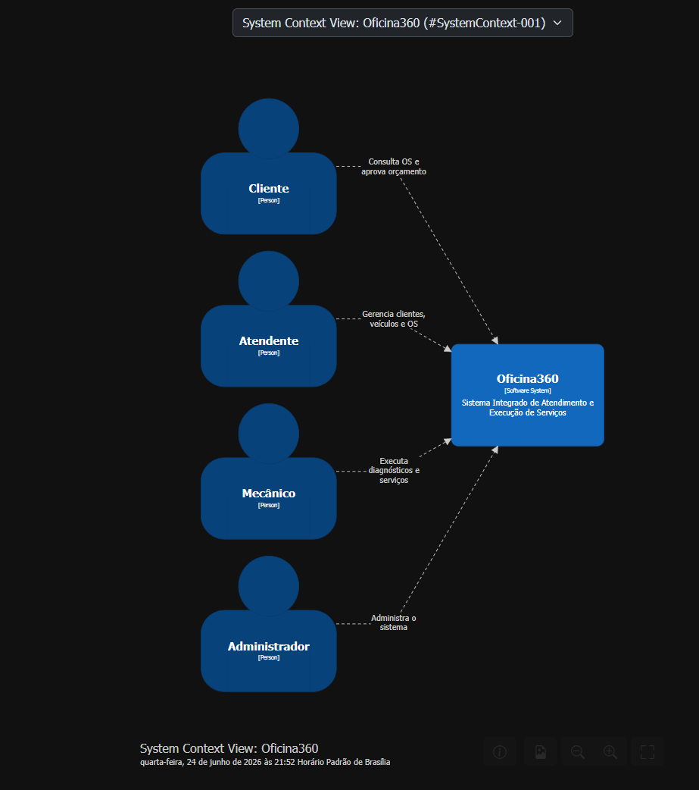
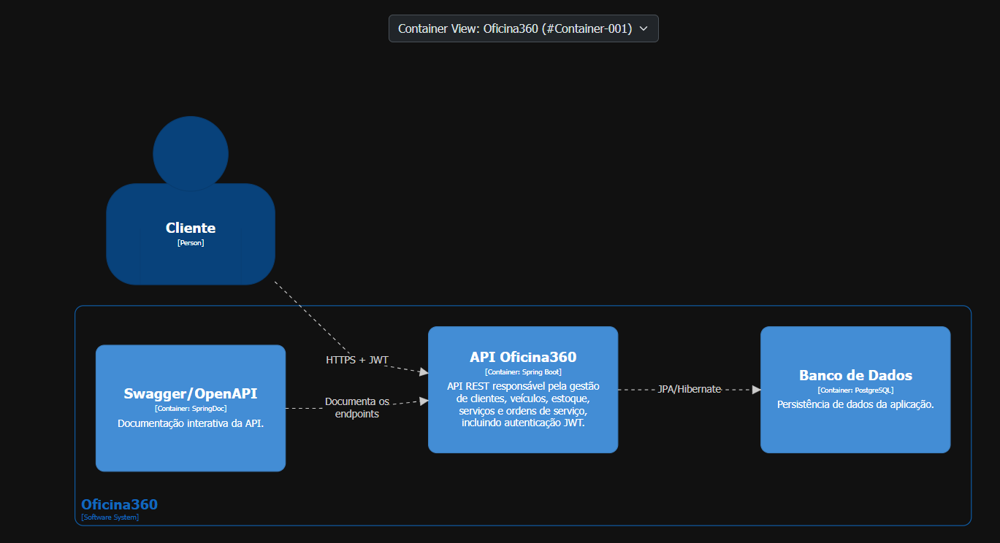
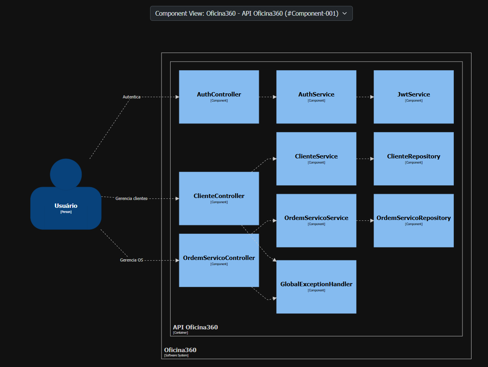
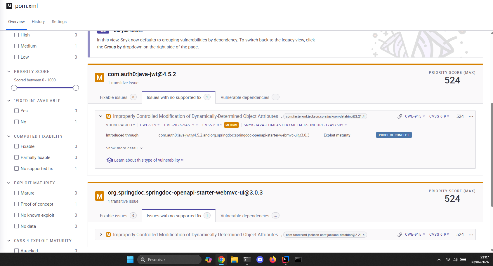
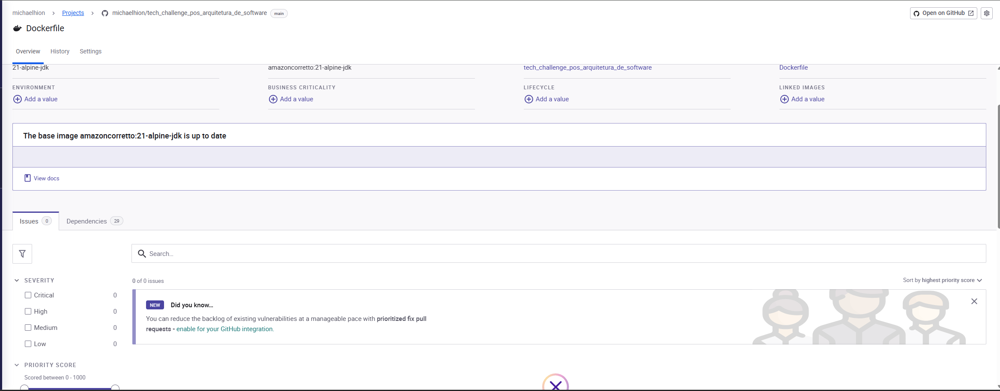
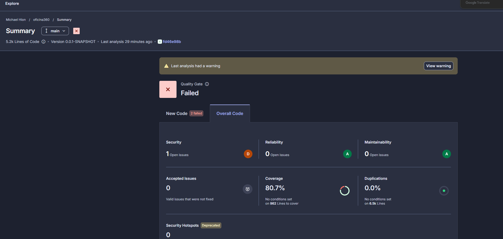

# Arquitetura da Solução - Oficina360

## Visão Geral

O Oficina360 é uma solução para gestão de oficinas mecânicas, desenvolvida para controlar todo o ciclo de atendimento de um veículo, desde sua recepção até a entrega ao cliente.

As principais capacidades da solução incluem:

- Gestão de Clientes;
- Gestão de Veículos;
- Gestão de Serviços;
- Gestão de Estoque;
- Gestão de Ordens de Serviço;
- Controle de Diagnóstico;
- Aprovação de Orçamentos;
- Controle da Execução dos Serviços;
- Controle de Acesso baseado em Papéis (RBAC);
- Autenticação utilizando JWT.

---

# Domain-Driven Design (DDD)

A modelagem do domínio foi realizada utilizando conceitos de Domain-Driven Design (DDD), buscando representar os processos da oficina mecânica através da linguagem do negócio.

## Domain Storytelling

O Domain Storytelling foi utilizado para compreender os processos da oficina e a interação entre os atores envolvidos no domínio.



---

## Context Map



### Relacionamentos

- Cliente Context → Ordem de Serviço Context
- Veículo Context → Ordem de Serviço Context
- Serviço Context → Ordem de Serviço Context
- Estoque Context → Ordem de Serviço Context

---

## Event Storming

O Event Storming foi utilizado para identificar eventos de domínio, comandos, agregados e fluxos de negócio do sistema.

Devido à dimensão do diagrama, a versão navegável encontra-se disponível no Miro:

🔗 https://miro.com/app/board/uXjVHWRAXWE=/
---

## Linguagem Ubíqua

A Linguagem Ubíqua define os principais termos utilizados no domínio da aplicação, garantindo alinhamento entre negócio e desenvolvimento.

📄 Documento:

[LINGUAGEM-UBIQUA.md](requisitos/LINGUAGEM-UBIQUA.md)

---

## Classificação dos Subdomínios

Durante a análise estratégica do domínio foram identificados os seguintes subdomínios:

### Core Domain

- Ordem de Serviço

### Supporting Domains

- Cliente Context
- Veículo Context
- Serviço Context
- Estoque Context

O contexto de Ordem de Serviço foi identificado como o núcleo do negócio, sendo responsável pelos principais processos operacionais da oficina.

---

# Modelo C4

A arquitetura da solução foi documentada utilizando o modelo C4, permitindo visualizar o sistema em diferentes níveis de abstração.

---

## Nível 1 — Contexto

O diagrama de contexto apresenta os atores que interagem com o sistema e uma visão macro da solução.



### Objetivo

Demonstrar:

- Quem utiliza o sistema;
- Qual o propósito da solução;
- Como os usuários interagem com o Oficina360.

### Arquivo Fonte

[C4_CONTEXT.dsl](c4/dsl/C4_CONTEXT.dsl)

---

## Nível 2 — Containers

O diagrama de containers apresenta a divisão lógica da aplicação em seus principais blocos tecnológicos.



### Objetivo

Demonstrar:

- Como o sistema foi dividido;
- Os principais containers da solução;
- As tecnologias utilizadas;
- A comunicação entre os containers.

### Containers Identificados

#### API Oficina360

Responsável por:

- Gestão de Clientes;
- Gestão de Veículos;
- Gestão de Serviços;
- Gestão de Estoque;
- Gestão de Ordens de Serviço;
- Validações de Negócio;
- Autenticação e Autorização JWT.

**Tecnologia:** Spring Boot

---

#### Banco de Dados

Responsável pela persistência das informações da aplicação.

**Tecnologia:** PostgreSQL

---

#### Swagger/OpenAPI

Responsável pela documentação e exploração dos endpoints REST.

**Tecnologia:** SpringDoc

### Arquivo Fonte

[C4_CONTAINER.dsl](c4/dsl/C4_CONTAINER.dsl)

---

## Nível 3 — Componentes

O diagrama de componentes apresenta a estrutura interna da API Oficina360.



### Objetivo

Demonstrar:

- Os principais componentes internos da aplicação;
- O relacionamento entre os componentes;
- A distribuição das responsabilidades dentro da API.

### Arquivo Fonte

[C4_COMPONENT.dsl](c4/dsl/C4_COMPONENT.dsl)

---

# Arquitetura em Camadas

A solução utiliza uma arquitetura em camadas baseada no padrão adotado pelo Spring Boot.

```text
Controller
      ↓
Service
      ↓
Repository
      ↓
Banco de Dados
```

---

# Segurança

Relatorio do snyk sobre pom.xml

Obs.: vulnerabilidade média sem solução no momento (30/06/26)



Relatorio do snyk sobre dockerfile



Relatorio sonar (tambem disponivel em https://sonarcloud.io/project/overview?id=michaelhion_tech_challenge_pos_arquitetura_de_software)

Obs.: Apresenta um falso positivo (no caso de uma api puramente rest) sobre desabilitar o csrf, se futuramente esta api tiver integração com um front end será necessário corrigir

