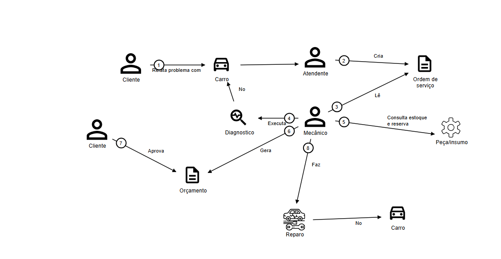
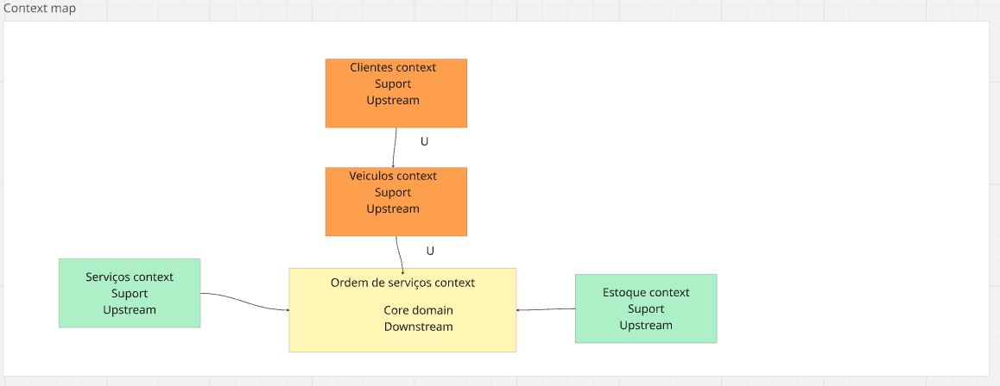
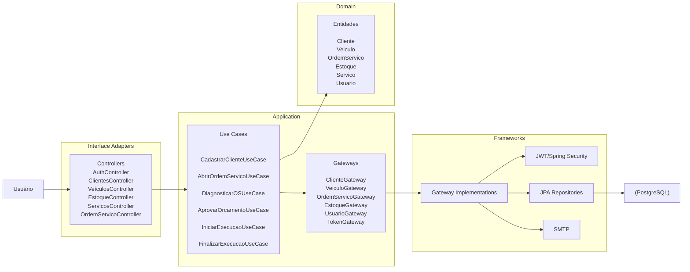
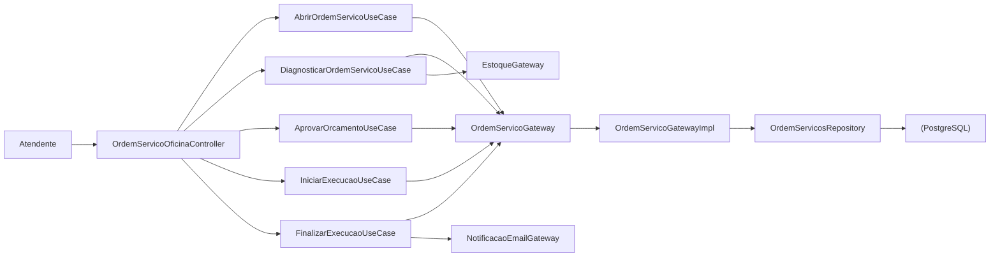
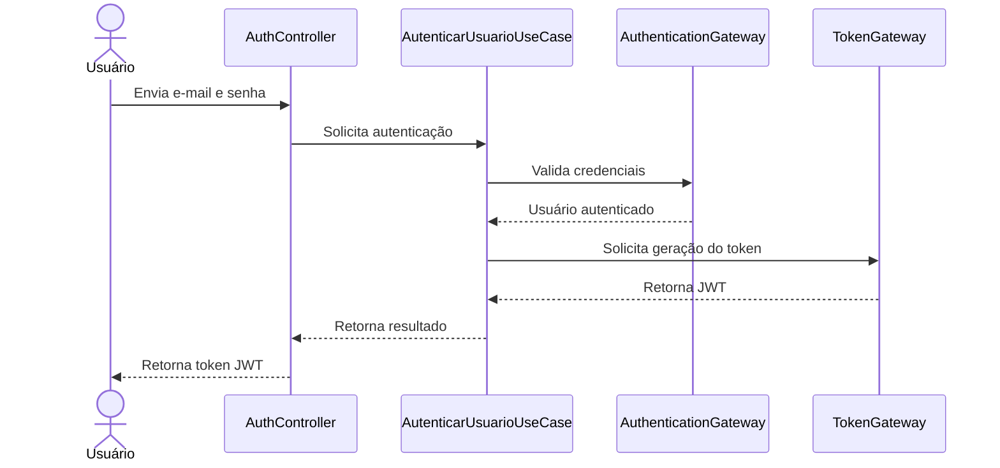
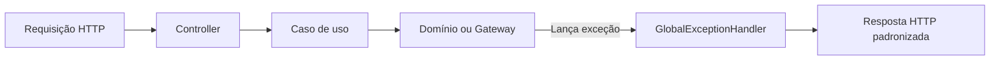
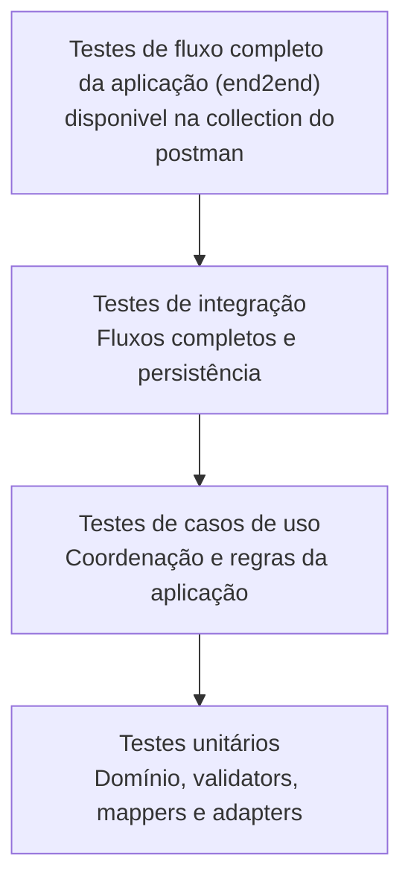

# Arquitetura da Solução - Oficina360

## Visão Geral

O Oficina360 é uma solução para gestão de oficinas mecânicas, desenvolvida para controlar todo o ciclo de atendimento de um veículo, desde sua recepção até a entrega ao cliente.

As principais capacidades da solução incluem:

- Gestão de Clientes;
- Gestão de Veículos;
- Gestão de Serviços;
- Gestão de Estoque;
- Gestão de Ordens de Serviço;
- Controle de Diagnóstico;
- Aprovação de Orçamentos;
- Controle da Execução dos Serviços;
- Controle de Acesso baseado em Papéis (RBAC);
- Autenticação utilizando JWT.

---

# Domain-Driven Design (DDD)

A modelagem do domínio foi realizada utilizando conceitos de Domain-Driven Design (DDD), buscando representar os processos da oficina mecânica através da linguagem do negócio.

## Domain Storytelling

O Domain Storytelling foi utilizado para compreender os processos da oficina e a interação entre os atores envolvidos no domínio.



---

## Context Map



### Relacionamentos

- Cliente Context → Ordem de Serviço Context
- Veículo Context → Ordem de Serviço Context
- Serviço Context → Ordem de Serviço Context
- Estoque Context → Ordem de Serviço Context

---

## Event Storming

O Event Storming foi utilizado para identificar eventos de domínio, comandos, agregados e fluxos de negócio do sistema.

Devido à dimensão do diagrama, a versão navegável encontra-se disponível no Miro:

🔗 https://miro.com/app/board/uXjVHWRAXWE=/
---

## Linguagem Ubíqua

A Linguagem Ubíqua define os principais termos utilizados no domínio da aplicação, garantindo alinhamento entre negócio e desenvolvimento.

📄 Documento:

[LINGUAGEM-UBIQUA.md](requisitos/LINGUAGEM-UBIQUA.md)

---

## Classificação dos Subdomínios

Durante a análise estratégica do domínio foram identificados os seguintes subdomínios:

### Core Domain

- Ordem de Serviço

### Supporting Domains

- Cliente Context
- Veículo Context
- Serviço Context
- Estoque Context

O contexto de Ordem de Serviço foi identificado como o núcleo do negócio, sendo responsável pelos principais processos operacionais da oficina.

---

# Modelo C4

A arquitetura da solução foi documentada utilizando o modelo C4, permitindo visualizar o sistema em diferentes níveis de abstração.

---

## Nível 1 — Contexto

O diagrama de contexto apresenta os atores que interagem com o sistema e uma visão macro da solução.

```mermaid
flowchart LR

    Cliente[Cliente]
    Atendente[Atendente]
    Mecanico[Mecânico]
    Admin[Administrador]

    Sistema[Oficina360]

    Cliente -->|Consulta status da OS\nAprova orçamento| Sistema

    Atendente -->|Gerencia clientes\nveículos e OS| Sistema

    Mecanico -->|Realiza diagnósticos\nExecuta serviços| Sistema

    Admin -->|Administra usuários\nConfigura sistema| Sistema
````

### Objetivo

Demonstrar:

- Quem utiliza o sistema;
- Qual o propósito da solução;
- Como os usuários interagem com o Oficina360.

### Arquivo Fonte do que foi feito na primeira fase

[C4_CONTEXT.dsl](c4/c4_fase_1/dsl/C4_CONTEXT.dsl)

---

## Nível 2 — Containers

O diagrama de containers apresenta a divisão lógica da aplicação em seus principais blocos tecnológicos.

```mermaid
flowchart LR

    Cliente[Usuários]

    subgraph Oficina360

        API["API Oficina360
        Spring Boot"]

        Swagger["Swagger/OpenAPI"]

    end

    Banco["(PostgreSQL)"]

    Email[Servidor SMTP]

    Cliente -->|HTTPS + JWT| API

    Swagger --> API

    API -->|JPA/Hibernate| Banco

    API -->|Notificações| Email
```

### Objetivo

Demonstrar:

- Como o sistema foi dividido;
- Os principais containers da solução;
- As tecnologias utilizadas;
- A comunicação entre os containers.

### Containers Identificados

#### API Oficina360

Responsável por:

- Gestão de Clientes;
- Gestão de Veículos;
- Gestão de Serviços;
- Gestão de Estoque;
- Gestão de Ordens de Serviço;
- Validações de Negócio;
- Autenticação e Autorização JWT.

**Tecnologia:** Spring Boot

---

#### Banco de Dados

Responsável pela persistência das informações da aplicação.

**Tecnologia:** PostgreSQL

---

#### Swagger/OpenAPI

Responsável pela documentação e exploração dos endpoints REST.

**Tecnologia:** SpringDoc

### Arquivo Fonte do que foi feito na primeira fase

[C4_CONTAINER.dsl](c4/c4_fase_1/dsl/C4_CONTAINER.dsl)

---

## Nível 3 — Componentes

O diagrama de componentes apresenta a estrutura interna da API Oficina360.


```mermaid
flowchart LR

    Usuario[Usuário]

    subgraph Interface Adapters

        Controllers["Controllers
        AuthController
        ClientesController
        VeículosController
        EstoqueController
        ServicosController
        OrdemServicoController"]

    end

    subgraph Application

        UseCases["Use Cases

        CadastrarClienteUseCase
        AbrirOrdemServicoUseCase
        DiagnosticarOSUseCase
        AprovarOrcamentoUseCase
        IniciarExecucaoUseCase
        FinalizarExecucaoUseCase"]

        Gateways["Gateways

        ClienteGateway
        VeiculoGateway
        OrdemServicoGateway
        EstoqueGateway
        UsuarioGateway
        TokenGateway"]
    end

    subgraph Domain

        Dominio["Entidades

        Cliente
        Veiculo
        OrdemServico
        Estoque
        Servico
        Usuario"]
    end

    subgraph Frameworks

        Adapters["Gateway Implementations"]

        Security["JWT/Spring Security"]

        Persistence["JPA Repositories"]

        Email["SMTP"]
    end

    Banco["(PostgreSQL)"]

    Usuario --> Controllers

    Controllers --> UseCases

    UseCases --> Dominio

    UseCases --> Gateways

    Gateways --> Adapters

    Adapters --> Persistence

    Adapters --> Security

    Adapters --> Email

    Persistence --> Banco
```
#### component detail


```mermaid
flowchart LR

    Usuario[Atendente]

    Controller["OrdemServicoOficinaController"]

    UC1["AbrirOrdemServicoUseCase"]

    UC2["DiagnosticarOrdemServicoUseCase"]

    UC3["AprovarOrcamentoUseCase"]

    UC4["IniciarExecucaoUseCase"]

    UC5["FinalizarExecucaoUseCase"]

    Gateway["OrdemServicoGateway"]

    EstoqueGateway["EstoqueGateway"]

    Notificacao["NotificacaoEmailGateway"]

    Adapter["OrdemServicoGatewayImpl"]

    Repo["OrdemServicosRepository"]

    Banco["(PostgreSQL)"]

    Usuario --> Controller

    Controller --> UC1
    Controller --> UC2
    Controller --> UC3
    Controller --> UC4
    Controller --> UC5

    UC1 --> Gateway
    UC2 --> Gateway
    UC2 --> EstoqueGateway

    UC3 --> Gateway

    UC4 --> Gateway

    UC5 --> Gateway
    UC5 --> Notificacao

    Gateway --> Adapter

    Adapter --> Repo

    Repo --> Banco
```

### Objetivo

Demonstrar:

- Os principais componentes internos da aplicação;
- O relacionamento entre os componentes;
- A distribuição das responsabilidades dentro da API.

### Arquivo Fonte do que foi feito na primeira fase

[C4_COMPONENT.dsl](c4/c4_fase_1/dsl/C4_COMPONENT.dsl)

---

# Arquitetura clean Architecture

A solução utiliza uma arquitetura clean arch + spring boot.

```text
┌───────────────────────────────┐
│ Frameworks & Drivers          │
│                               │
│ controllers                   │
│ security                      │
│ repositories                  │
│ spring configuration          │
└──────────────┬────────────────┘
               │
┌──────────────▼────────────────┐
│ Interface Adapters            │
│                               │
│ GatewayImpl                   │
│ DTO Mappers                   │
│ Request/Response DTO          │
└──────────────┬────────────────┘
               │
┌──────────────▼────────────────┐
│ Application Business Rules    │
│                               │
│ UseCases                      │
│ Factories                     │
│ Validators                    │
│ Services                      │
│ Finders                       │
└──────────────┬────────────────┘
               │
┌──────────────▼────────────────┐
│ Enterprise Business Rules     │
│                               │
│ Cliente                       │
│ Veiculo                       │
│ OrdemServico                  │
│ Estoque                       │
│ Servico                       │
│ Usuario                       │
└───────────────────────────────┘
```

---

## Segurança

A segurança do Oficina360 é aplicada em diferentes níveis:

1. segurança da aplicação;
2. autenticação e autorização;
3. proteção dos dados sensíveis;
4. segurança da infraestrutura;
5. segurança da pipeline;
6. análise contínua de vulnerabilidades.

### Autenticação

A autenticação utiliza Spring Security e JWT.

O fluxo ocorre da seguinte forma:


```mermaid
sequenceDiagram
    actor Usuario as Usuário
    participant API as AuthController
    participant UC as AutenticarUsuarioUseCase
    participant Auth as AuthenticationGateway
    participant Token as TokenGateway

    Usuario->>API: Envia e-mail e senha
    API->>UC: Solicita autenticação
    UC->>Auth: Valida credenciais
    Auth-->>UC: Usuário autenticado
    UC->>Token: Solicita geração do token
    Token-->>UC: Retorna JWT
    UC-->>API: Retorna resultado
    API-->>Usuario: Retorna token JWT
```

Nas requisições protegidas, o token deve ser enviado no header:

```http
Authorization: Bearer <token>
```

O `JwtAuthenticationFilter` intercepta as requisições, valida o token e
configura o contexto de segurança.

### Autorização

A autorização utiliza dois níveis de verificação:

- perfil do usuário;
- propriedade do recurso.

Perfis disponíveis:

- `ADMIN`;
- `CLIENTE`;
- `ATENDENTE`;
- `MECANICO`.

Além do perfil, a aplicação verifica se o cliente possui autorização para
acessar o recurso solicitado.

Exemplos:

- um cliente pode consultar suas próprias ordens de serviço;
- um cliente pode consultar seus próprios veículos;
- um cliente pode aprovar seu próprio orçamento;
- um cliente não pode consultar informações de outro cliente;
- um cliente não pode aprovar o orçamento de outra conta.

A lógica de autorização utiliza o `AutorizacaoClienteUseCase` e o
`UsuarioAutenticadoGateway`, mantendo a regra separada dos Controllers.

### Proteção de senhas

As senhas não são armazenadas em texto puro.

O caso de uso utiliza o contrato `PasswordEncoderGateway`. A implementação
concreta integra o mecanismo de codificação do Spring Security.

Essa separação evita que os casos de uso dependam diretamente do framework
de segurança.

### Proteção de dados sensíveis

Os seguintes dados não devem ser expostos em logs:

- senhas;
- tokens JWT;
- CPF;
- CNPJ;
- credenciais do banco.

O `RequestResponseLoggingFilter` registra requisições e respostas com
sanitização de campos sensíveis.

### Secrets da aplicação

Os valores sensíveis utilizados no ambiente Kubernetes são armazenados em
GitHub Secrets:

- `DB_USERNAME`;
- `DB_PASSWORD`;
- `JWT_SECRET`.

Durante o deploy, a pipeline gera temporariamente um Secret Kubernetes.

O arquivo com valores reais não é versionado no repositório e é removido
após a execução.

A codificação Base64 usada pelo Kubernetes não representa criptografia.
Por isso, o acesso ao Secret e aos arquivos temporários deve permanecer
restrito.

### Segurança da infraestrutura

A infraestrutura utiliza:

- Security Group com regras explícitas;
- PostgreSQL exposto somente dentro do cluster;
- API exposta pelo NodePort autorizado;
- API Kubernetes sem exposição pública;
- Instance Profile associado à EC2;
- AWS Systems Manager para gerenciamento remoto.

O PostgreSQL utiliza um Service do tipo `ClusterIP` e não pode ser acessado
diretamente pela internet.

### Segurança do deploy

O deploy utiliza o AWS Systems Manager em vez de SSH.

```text
GitHub Actions
    |
    | ssm:SendCommand
    v
AWS Systems Manager
    |
    v
SSM Agent na EC2
    |
    v
deploy.sh
    |
    v
sudo k3s kubectl
```

Essa abordagem evita:

- armazenamento de chave SSH no GitHub;
- abertura de SSH para os runners;
- transferência do kubeconfig;
- exposição pública da API Kubernetes.

### Análise contínua

A solução utiliza:

- SonarCloud;
- Snyk;
- OWASP Dependency Check;
- Dependabot;
- GitHub Actions.

Essas ferramentas auxiliam na identificação de:

- dependências vulneráveis;
- Security Hotspots;
- problemas de qualidade;
- Code Smells;
- bibliotecas desatualizadas;
- vulnerabilidades nas imagens e no Dockerfile.

### Riscos conhecidos

A solução acadêmica possui riscos conhecidos:

- utilização de HTTP sem TLS no NodePort;
- cluster K3s com nó único;
- PostgreSQL no mesmo nó da aplicação;
- Secret Kubernetes armazenado no cluster;
- IP público da EC2;
- credenciais temporárias do laboratório.

Em produção, seriam recomendados:

- HTTPS;
- Load Balancer;
- AWS Secrets Manager;
- políticas IAM de menor privilégio;
- banco de dados gerenciado;
- cluster com múltiplos nós;
- subnets privadas;
- políticas de segurança do Kubernetes.

---

## Tratamento de erros

A aplicação possui uma estratégia de tratamento de erros distribuída entre
domínio, casos de uso e camada web.

### Categorias de erro

#### Erros de domínio

Representam violações das regras centrais do negócio.

Exemplos:

- `TransicaoStatusInvalidaException`;
- `DiagnosticoSemServicoException`;
- `DecisaoOrcamentoObrigatoriaException`;
- `InicioExecucaoNaoRegistradoException`;
- `ItemEstoqueInvalidoException`.

Essas exceções são criadas quando uma operação tenta deixar uma entidade em
um estado inválido.

#### Erros de aplicação

Representam falhas identificadas durante a execução dos casos de uso.

Exemplos:

- `RecursoNaoEncontradoException`;
- `ClienteJaCadastradoException`;
- `UsuarioJaCadastradoException`;
- `VeiculosJaCadastradoException`;
- `RegraDeNegocioException`;
- `PlacaJaExisteException`.

#### Erros de infraestrutura e concorrência

Representam falhas relacionadas a recursos técnicos ou operações
concorrentes.

Exemplos:

- `ConflitoConcorrenciaEstoqueException`;
- `ConflitoException`;
- falha no envio de e-mail;
- falha de persistência;
- falha de autenticação.

### Fluxo do tratamento de erros


```mermaid
flowchart LR
    request["Requisição HTTP"] --> controller["Controller"]
    controller --> usecase["Caso de uso"]
    usecase --> domain["Domínio ou Gateway"]
    domain -->|"Lança exceção"| handler["GlobalExceptionHandler"]
    handler --> response["Resposta HTTP padronizada"]
```

O `GlobalExceptionHandler` converte as exceções em respostas HTTP
padronizadas, impedindo a exposição de stack traces ou detalhes internos.

### Estrutura da resposta

Exemplo:

```json
{
  "status": 404,
  "erro": "Recurso não encontrado",
  "mensagem": "Ordem de serviço não encontrada"
}
```

Para erros de regra de negócio, a aplicação utiliza uma representação
específica:

```text
ErroRegraDeNegocioResponse
```

### Mapeamento recomendado

| Categoria | Exemplo | Status HTTP |
|---|---|---:|
| Entrada inválida | Campo obrigatório ausente | 400 |
| Regra de negócio | Transição de status inválida | 422 |
| Não autenticado | Token ausente ou inválido | 401 |
| Não autorizado | Acesso a recurso de outro cliente | 403 |
| Não encontrado | Ordem de serviço inexistente | 404 |
| Conflito | Cliente ou placa já cadastrados | 409 |
| Concorrência | Estoque alterado simultaneamente | 409 |
| Erro inesperado | Falha não tratada | 500 |

> O mapeamento acima deve corresponder às anotações e handlers realmente
> implementados no `GlobalExceptionHandler`.

### Concorrência no estoque

A aplicação possui tratamento específico para conflitos concorrentes de
estoque.

Esse mecanismo evita que duas operações reservem quantidade superior ao
estoque disponível.

Quando o conflito é identificado, a aplicação retorna uma resposta
controlada, em vez de expor uma exceção do banco de dados.

### Falhas de notificação

Falhas no envio de e-mail são representadas por exceções específicas, como:

```text
FalhaEnvioEmailException
```

A estratégia adotada deve deixar claro se a falha:

- interrompe o caso de uso;
- é registrada para nova tentativa;
- é apenas registrada em log;
- retorna erro ao usuário.

### Testes do tratamento de erros

A estratégia é validada por testes como:

```text
GlobalExceptionHandlerTest
OrdemServicoTest
OrdemServicoEstoqueValidatorTest
OrdemServicoServicoValidatorTest
```

Também existem testes de integração que exercitam respostas de erro durante
os fluxos da ordem de serviço.

---

## Estratégia de testes

O Oficina360 utiliza uma estratégia de testes em diferentes níveis.

### Pirâmide de testes


```mermaid
flowchart TB
    end2end["Testes de fluxo completo da aplicação (end2end)<br/> disponivel na collection do postman"]
    integration["Testes de integração<br/>Fluxos completos e persistência"]
    application["Testes de casos de uso<br/>Coordenação e regras da aplicação"]
    unit["Testes unitários<br/>Domínio, validators, mappers e adapters"]

    end2end --> integration
    integration --> application
    application --> unit
```
obs collection com teste end 2 end disponivel aqui [Collections postman](postman) , necessário subir a aplicação para testar e apontar para o ambiente que estiver usando no enviroment tambem disponibilizado

### Testes de domínio

Validam regras de negócio sem dependência do Spring ou do banco.

Exemplos:

- `OrdemServicoTest`;
- `EstoqueTest`.

O `OrdemServicoTest` valida, entre outros pontos:

- criação da ordem;
- início do diagnóstico;
- adição de serviços;
- adição de itens do estoque;
- finalização do diagnóstico;
- aprovação do orçamento;
- início da execução;
- finalização;
- entrega;
- transições inválidas;
- cálculo de valores.

### Testes de casos de uso

Validam a coordenação entre domínio e gateways.

Exemplos:

- `CadastrarClienteUseCaseTest`;
- `ReservarEstoqueUseCaseTest`;
- `AprovarOrcamentoUseCaseTest`;
- `DiagnosticarOrdemServicoUseCaseTest`;
- `ConsultarStatusOsUseCaseTest`;
- `ListarOrdensServicoQueryTest`;
- `NotificarStatusOrdemServicoServiceTest`.

### Testes dos adapters

Validam as implementações que conectam os casos de uso à infraestrutura.

Exemplos:

- `ClienteGatewayImplTest`;
- `EstoqueGatewayImplTest`;
- `OrdemServicoGatewayImplTest`;
- `NotificacaoEmailGatewayImplTest`;
- `TempoExecucaoServicoGatewayImplTest`.

### Testes da camada web

Validam Controllers, contratos HTTP, segurança e tratamento de erros.

Exemplos:

- `AuthControllerTest`;
- `ClientesControllerTest`;
- `OrdemServicoClienteControllerTest`;
- `OrdemServicoOficinaControllerTest`;
- `GlobalExceptionHandlerTest`;
- `JwtAuthenticationFilterTest`.

### Testes de integração

Os testes de integração validam fluxos completos da aplicação.

Fluxos cobertos:

- autenticação;
- criação de ordem de serviço;
- diagnóstico;
- aprovação de orçamento;
- edição;
- início da execução;
- finalização;
- listagem das ordens;
- regras do fluxo completo.

Classes principais:

```text
AuthIT
OrdemServicoCriacaoIT
OrdemServicoDiagnosticoIT
OrdemServicoAprovacaoIT
OrdemServicoExecucaoIT
OrdemServicoFinalizarExecucaoIT
OrdemServicoListarIT
OrdemServicoFluxosIT
```

### Teste arquitetural

O projeto possui:

```text
ArchitectureTest
```

Esse teste deve validar regras como:

- domínio não depende de frameworks;
- casos de uso não dependem da camada web;
- Controllers pertencem à camada de frameworks;
- implementações dos gateways ficam fora do núcleo;
- entidades JPA não substituem entidades de domínio.

O teste arquitetural reduz o risco de regressão da Clean Architecture.

### Execução

Executar testes:

```bash
./mvnw test
```

Executar verificação completa:

```bash
./mvnw clean verify
```

### Relatório de cobertura

O relatório JaCoCo é gerado em:

```text
docs/security/jacoco/index.html
```

A pipeline valida uma cobertura mínima definida no projeto.

### Resultado da cobertura

Cobertura total: 86.2%

consultar [Sonar](https://sonarcloud.io/component_measures?id=michaelhion_tech_challenge_pos_arquitetura_de_software&metric=coverage&view=list) para relatorio completo

### Evidências

As evidências estão disponíveis em:

- relatório HTML do JaCoCo;
- relatório XML do JaCoCo;
- relatório CSV do JaCoCo;
- execução da pipeline;
- dashboard do SonarCloud;
- testes de integração no código-fonte.
