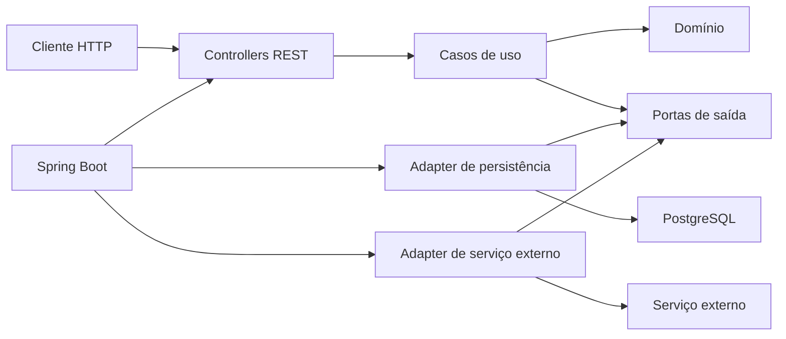
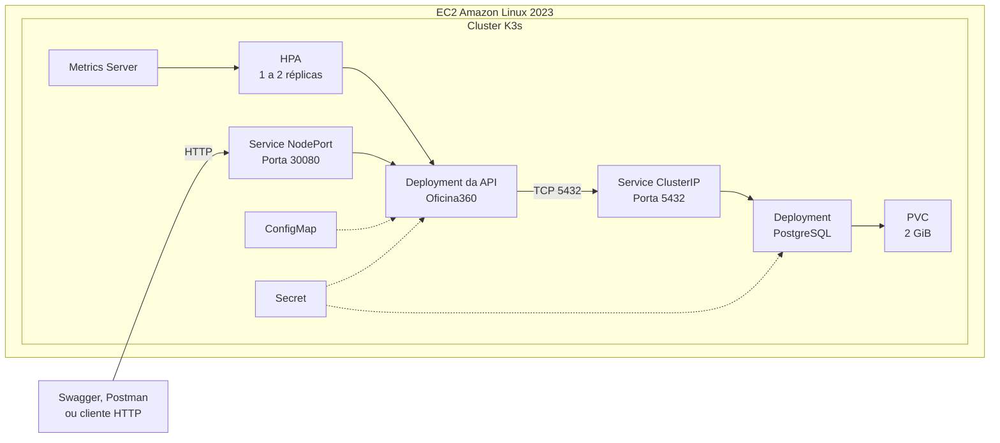
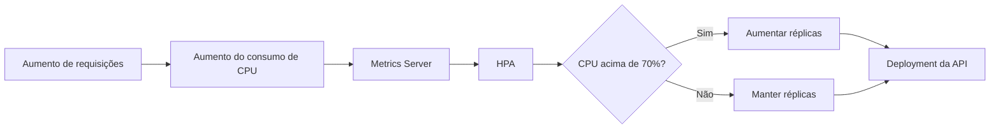
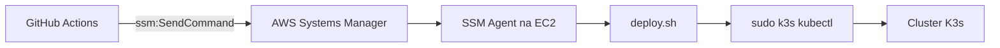
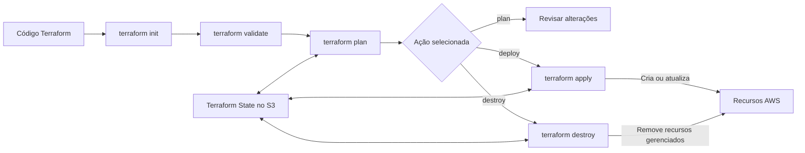
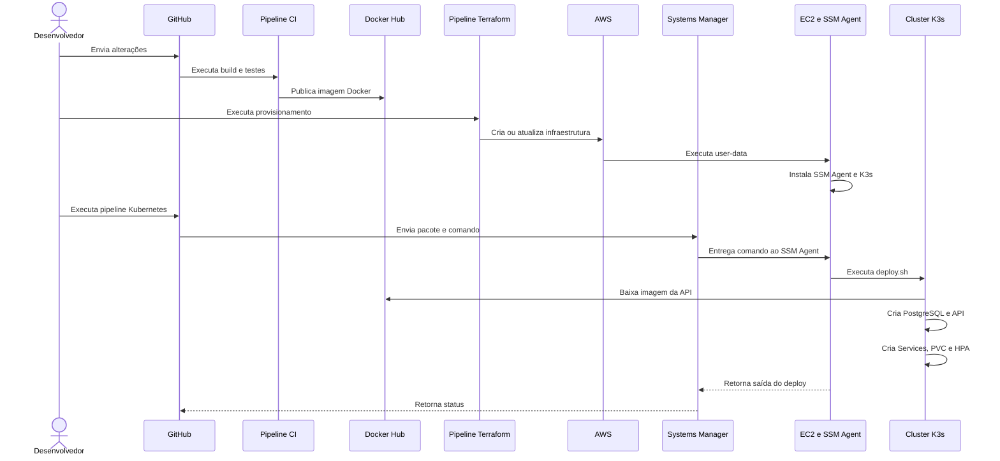

# Oficina360 - Evolução da Fase 2

## Visão geral

A Fase 2 do Oficina360 teve como objetivo evoluir a solução desenvolvida na
fase anterior, incorporando práticas modernas de arquitetura de software,
conteinerização, orquestração, infraestrutura como código, computação em
nuvem, escalabilidade automática e integração e entrega contínuas.

Na Fase 1, a aplicação foi desenvolvida como uma API REST monolítica,
organizada em uma arquitetura tradicional em camadas:

```text
Controller
    |
    v
Service
    |
    v
Repository
    |
    v
Banco de Dados
```

Na Fase 2, a solução foi evoluída para:

- utilizar os princípios da Clean Architecture;
- separar as regras de negócio dos frameworks e detalhes de infraestrutura;
- executar a aplicação e o PostgreSQL em Kubernetes;
- provisionar a infraestrutura AWS com Terraform;
- automatizar build, testes e deploy com GitHub Actions;
- utilizar o AWS Systems Manager para execução remota;
- permitir escalabilidade automática da API com HPA;
- centralizar o Terraform State em um backend remoto no Amazon S3;
- preparar a aplicação para suportar o aumento da demanda.

---

## 1. Refatoração para Clean Architecture

Na Fase 1, o código estava organizado em uma arquitetura tradicional em
camadas, composta principalmente por Controllers, Services e Repositories.

Embora essa abordagem fornecesse uma separação inicial de responsabilidades,
as regras de negócio ainda estavam próximas dos frameworks e das tecnologias
de infraestrutura.

Na Fase 2, a aplicação foi refatorada com base nos princípios da Clean
Architecture.

Atualmente, o projeto está dividido em três áreas principais:

- **Domínio:** entidades, regras de negócio, objetos de valor, exceções e
  contratos;
- **Casos de uso:** coordenação dos fluxos e operações da aplicação;
- **Frameworks e adapters:** controllers REST, Spring Boot, persistência,
  segurança, configurações e integrações externas.

A principal regra dessa arquitetura é que as camadas externas podem depender
das camadas internas, porém o domínio não deve depender diretamente de
frameworks ou tecnologias externas.

### 1.1 Domínio

A camada de domínio representa o núcleo da aplicação.

Ela contém:

- entidades de negócio;
- regras de negócio;
- enums do domínio;
- exceções de negócio;
- contratos necessários para os casos de uso.

O domínio deve permanecer independente de tecnologias externas, como:

- Spring Boot;
- Spring Data;
- JPA;
- PostgreSQL;
- controllers REST;
- ferramentas de mensageria;
- serviços externos.

Essa independência permite testar e evoluir as regras de negócio sem depender
diretamente da infraestrutura.

### 1.2 Casos de uso

A camada de casos de uso coordena os fluxos da aplicação.

Ela é responsável por operações como:

- abertura de uma ordem de serviço;
- consulta de ordem de serviço;
- consulta do status da ordem;
- realização do diagnóstico;
- aprovação ou recusa do orçamento;
- início da execução;
- finalização da ordem de serviço;
- controle e reserva de estoque;
- atualização do status;
- listagem ordenada das ordens de serviço.

Os casos de uso utilizam contratos para acessar persistência e integrações
externas, sem conhecer diretamente suas implementações.

### 1.3 Frameworks e adapters

A camada de frameworks e adapters contém os componentes externos da
aplicação.

Entre eles estão:

- controllers REST;
- configurações do Spring Boot;
- autenticação e autorização;
- persistência com Spring Data JPA;
- implementações dos repositories;
- integração com PostgreSQL;
- documentação com Swagger e OpenAPI;
- observabilidade;
- implementação de serviços externos;
- configuração de segurança com JWT.

### 1.4 Fluxo de dependências



A direção das dependências protege as regras de negócio. Os detalhes externos
dependem dos contratos definidos pelas camadas internas, enquanto o domínio
permanece independente dos frameworks.

---

## 2. Conteinerização

A aplicação permanece conteinerizada com Docker.

Durante a Fase 2 foram revisados:

- Dockerfile;
- Docker Compose;
- variáveis de ambiente;
- configuração do PostgreSQL;
- health checks;
- processo de construção da imagem;
- execução local do ambiente;
- integração da imagem com a pipeline.

O Docker Compose permite executar a aplicação e o PostgreSQL localmente.

```text
Docker Compose
    |
    +-- Oficina360 API
    |
    +-- PostgreSQL
```

O Dockerfile é utilizado pela pipeline para gerar a imagem da aplicação.

Após a construção, a imagem é publicada no Docker Hub e utilizada pelo
Deployment Kubernetes.

---

## 3. Orquestração com Kubernetes

Foram implementados manifests Kubernetes para implantar a API Oficina360 e o
PostgreSQL dentro de um cluster K3s hospedado em uma instância EC2 na AWS.

A solução utiliza os seguintes recursos:

- Namespace;
- Secret;
- ConfigMap;
- PersistentVolumeClaim;
- Deployment do PostgreSQL;
- Service do PostgreSQL;
- Deployment da API;
- Service da API;
- Horizontal Pod Autoscaler.

### 3.1 Organização dos manifests

Os manifests e scripts estão disponíveis no diretório:

```text
k8s/
├── 1-namespace.yaml
├── 3-configmap.yaml
├── 5-postgres-pvc.yaml
├── 6-postgres-service.yaml
├── 7-postgres-deployment.yaml
├── 8-api-deployment.yaml
├── 9-api-service.yaml
├── 10-hpa.yaml
└── deploy.sh
```

O manifesto com os valores reais do Secret não é armazenado no repositório.

Durante o deploy, a pipeline utiliza os GitHub Secrets para gerar
temporariamente o arquivo:

```text
secret.yaml
```

Depois da geração, o Secret é incluído no pacote enviado para a EC2 e aplicado
no cluster.

### 3.2 Script de deploy

O script `deploy.sh` é responsável por executar os manifests na ordem
necessária.

Entre suas responsabilidades estão:

- verificar se os arquivos obrigatórios existem;
- confirmar que o serviço K3s está ativo;
- aguardar a API do Kubernetes;
- validar os manifests;
- aplicar o Namespace;
- aplicar o Secret;
- aplicar o ConfigMap;
- criar o PVC;
- implantar o PostgreSQL;
- aguardar o PVC ficar vinculado;
- aguardar o rollout do PostgreSQL;
- implantar a API;
- criar o Service da API;
- aguardar o rollout da API;
- aplicar o HPA;
- apresentar o resultado da implantação;
- apresentar informações de diagnóstico em caso de erro.

A ordem controlada evita que um Deployment seja criado antes dos recursos dos
quais depende.

### 3.3 Arquitetura Kubernetes

A API Oficina360 e o PostgreSQL são executados em um cluster K3s hospedado
em uma instância EC2.

O PostgreSQL permanece disponível apenas dentro do cluster. A API é exposta
externamente por um Service do tipo NodePort.



#### Componentes

- **Service NodePort:** expõe a API externamente pela porta `30080`;
- **Deployment da API:** mantém os Pods do Oficina360 em execução;
- **Service ClusterIP:** fornece um endereço interno estável para o banco;
- **Deployment PostgreSQL:** mantém o banco de dados em execução;
- **PVC:** fornece persistência para os dados do PostgreSQL;
- **ConfigMap:** armazena configurações não sensíveis;
- **Secret:** armazena credenciais do banco, chave JWT e dados SMTP;
- **Metrics Server:** fornece as métricas utilizadas pelo HPA;
- **HPA:** ajusta a quantidade de réplicas da API de acordo com o consumo.

#### Fluxo principal

```text
Cliente HTTP
→ Service NodePort
→ API Oficina360
→ Service ClusterIP
→ PostgreSQL
→ PVC
```

### 3.4 Namespace

O Namespace utilizado pela aplicação é:

```text
oficina360
```

O Namespace separa logicamente os recursos da aplicação dos componentes
internos do K3s.

Dentro desse Namespace são criados:

- API;
- PostgreSQL;
- Services;
- ConfigMap;
- Secret;
- PVC;
- HPA.

### 3.5 Secret

O Secret contém as informações sensíveis utilizadas pela API e pelo
PostgreSQL:

```text
DB_USERNAME
DB_PASSWORD
JWT_SECRET
```

Esses valores são armazenados como GitHub Secrets.

Durante a execução da pipeline, os valores são utilizados para criar um
manifesto temporário do Kubernetes.

O arquivo temporário não deve ser versionado no Git.

É importante destacar que Base64 é apenas uma codificação e não representa
criptografia. Por isso, o arquivo deve ser tratado como sensível e removido
depois da execução.

### 3.6 ConfigMap

O ConfigMap contém configurações não sensíveis da aplicação, como:

- perfil ativo;
- endereço interno do banco;
- porta da aplicação;
- configurações operacionais;
- parâmetros que podem variar entre ambientes.

A separação entre ConfigMap e Secret permite manter configurações comuns
versionadas sem expor credenciais.

### 3.7 PostgreSQL

O PostgreSQL é executado dentro do cluster K3s.

O Deployment do PostgreSQL é responsável por:

- executar a imagem do PostgreSQL;
- carregar usuário e senha pelo Secret;
- montar o volume persistente;
- definir recursos computacionais;
- verificar a disponibilidade do banco;
- recriar o Pod em caso de falha.

O banco é acessível somente dentro do cluster por meio de um Service do tipo
ClusterIP na porta `5432`.

```text
Oficina360 API
    |
    | TCP 5432
    v
Service PostgreSQL
    |
    v
Pod PostgreSQL
```

A API utiliza o nome do Service como endereço do banco. Dessa forma, a API
não depende diretamente do IP do Pod.

### 3.8 Persistência

O PostgreSQL utiliza um PersistentVolumeClaim com a StorageClass
`local-path`.

```text
Pod PostgreSQL
    |
    v
Volume Mount
    |
    v
PersistentVolumeClaim
    |
    v
PersistentVolume
    |
    v
Disco da EC2
```

O PVC permite preservar os dados durante a recriação do Pod.

Como o volume está associado ao nó, a recriação completa da EC2 pode causar
a perda dos dados. Em um ambiente produtivo, uma alternativa seria utilizar
Amazon EBS ou Amazon RDS for PostgreSQL.

### 3.9 API Oficina360

A API é executada em um Deployment Kubernetes.

O Deployment é responsável por:

- executar a imagem da aplicação;
- carregar configurações pelo ConfigMap;
- carregar dados sensíveis pelo Secret;
- definir requests e limits;
- configurar probes;
- controlar a quantidade desejada de Pods;
- permitir a atuação do HPA.

A imagem da aplicação é obtida no Docker Hub pelo containerd do K3s.

### 3.10 Service da API

A API é exposta por um Service do tipo NodePort.

Configuração adotada:

```text
Porta da aplicação: 8080
NodePort: 30080
```

Fluxo de acesso:

```text
Cliente HTTP
    |
    v
IP público da EC2
    |
    | Porta 30080
    v
Security Group
    |
    v
Service NodePort
    |
    v
Pod da API na porta 8080
```

A aplicação pode ser acessada por:

```text
http://IP_PUBLICO_DA_EC2:30080
```

O Swagger pode ser acessado por:

```text
http://IP_PUBLICO_DA_EC2:30080/swagger-ui/index.html
```

O health check pode ser acessado por:

```text
http://IP_PUBLICO_DA_EC2:30080/actuator/health
```

---

## 4. Escalabilidade horizontal

A escalabilidade automática da API foi implementada com o Horizontal Pod
Autoscaler.

O HPA monitora o Deployment:

```text
oficina360-api
```

Configuração adotada no ambiente acadêmico:

```text
Quantidade mínima de réplicas: 1
Quantidade máxima de réplicas: 2
Meta de utilização de CPU: 70%
```

O HPA aumenta ou reduz a quantidade de réplicas dos Pods. O HPA não cria
novas instâncias EC2.

### 4.1 Funcionamento



O fluxo de escalabilidade ocorre da seguinte forma:

1. a aplicação recebe requisições;
2. o consumo de CPU dos Pods aumenta;
3. o Metrics Server coleta as métricas;
4. o HPA consulta as métricas;
5. o consumo é comparado com a meta de CPU;
6. o HPA calcula a quantidade desejada de réplicas;
7. o Deployment cria novos Pods quando necessário;
8. o Service distribui o tráfego entre os Pods disponíveis;
9. quando o consumo diminui, o HPA pode reduzir as réplicas.

Para o HPA baseado em CPU funcionar corretamente, o Deployment precisa
declarar `resources.requests.cpu`.

O Metrics Server utilizado é o componente instalado nativamente pelo K3s.

---

## 5. Infraestrutura em nuvem com AWS

A infraestrutura da Fase 2 foi provisionada na AWS para hospedar o cluster
K3s e os componentes da aplicação.

### 5.1 Recursos utilizados

Os principais recursos da arquitetura são:

- VPC;
- subnet;
- Internet Gateway;
- Route Table;
- Security Group;
- instância EC2;
- IAM Instance Profile;
- AWS Systems Manager;
- Amazon S3;
- K3s;
- containerd.

### 5.2 Recursos fornecidos pelo ambiente acadêmico

Alguns recursos são fornecidos pelo ambiente acadêmico:

- VPC;
- subnet;
- Internet Gateway;
- AMI Amazon Linux 2023;
- `LabInstanceProfile`.

Os identificadores desses recursos são informados ao Terraform por meio de
variáveis.

### 5.3 Recursos gerenciados pelo Terraform

O Terraform cria ou configura:

- Route Table pública;
- rota de saída para o Internet Gateway;
- associação da Route Table com a subnet;
- Security Group;
- instância EC2;
- associação do Instance Profile à EC2;
- execução do script `user-data.sh`;
- configuração do backend remoto do Terraform State.

O Terraform reutiliza os recursos fornecidos pelo laboratório e provisiona
os componentes necessários para hospedar o K3s.

### 5.4 Configuração da EC2

A instância EC2 utiliza:

```text
Sistema operacional: Amazon Linux 2023
Orquestrador: K3s
Runtime de containers: containerd
Gerenciamento remoto: AWS Systems Manager
```

Durante o primeiro boot, a EC2 executa o script:

```text
infra/user-data.sh
```

O script é responsável por:

- validar o sistema operacional;
- configurar o SSM Agent;
- configurar swap;
- instalar o K3s;
- iniciar o serviço K3s;
- aguardar a API Kubernetes;
- validar o nó;
- criar um marcador de conclusão do bootstrap.

### 5.5 AWS Systems Manager

O AWS Systems Manager é utilizado para executar comandos dentro da EC2.



Essa abordagem evita:

- abertura de SSH para os runners do GitHub;
- armazenamento de chave SSH na pipeline;
- exposição pública da API Kubernetes;
- transferência do kubeconfig para o GitHub Actions.

A API Kubernetes é acessada localmente dentro da EC2 pelo comando:

```bash
sudo k3s kubectl
```

### 5.6 Terraform State no Amazon S3

O Terraform State registra o vínculo entre os recursos declarados no código e
os recursos reais existentes na AWS.

O backend remoto no Amazon S3 permite:

- centralizar o state;
- utilizar o mesmo state em execuções locais e na pipeline;
- evitar divergências entre ambientes;
- manter o state fora do repositório;
- recuperar o estado entre execuções;
- facilitar a automação;
- manter histórico por meio do versionamento do bucket, quando habilitado.

O state não deve ser editado ou excluído manualmente enquanto os recursos
correspondentes existirem na AWS.

Operações locais e operações da pipeline devem utilizar o mesmo backend para
evitar recursos órfãos ou tentativas de criação duplicada.

---

## 6. Infraestrutura como código com Terraform

Os arquivos Terraform estão localizados no diretório:

```text
infra/
```

O Terraform é responsável por provisionar e configurar os recursos
necessários para hospedar o cluster K3s.

### 6.1 Fluxo do Terraform



### 6.2 Processo de provisionamento

```text
GitHub Actions
    |
    v
Terraform init
    |
    v
Terraform validate
    |
    v
Terraform plan
    |
    v
Terraform apply
    |
    v
Infraestrutura AWS
    |
    v
EC2 executa user-data.sh
    |
    v
SSM Agent e K3s disponíveis
```

### 6.3 Ações disponíveis na pipeline

A pipeline Terraform oferece as seguintes ações:

- **plan:** exibe as alterações sem modificar a infraestrutura;
- **deploy:** cria ou atualiza os recursos;
- **destroy:** remove os recursos conhecidos pelo Terraform State.

---

## 7. Integração e entrega contínuas

O GitHub Actions centraliza as automações do projeto.

A automação foi dividida por responsabilidade para facilitar o entendimento,
a manutenção e a execução controlada.

### 7.1 Pipeline de integração contínua

A pipeline de integração contínua é responsável por:

- compilar a aplicação;
- executar os testes automatizados;
- validar a cobertura mínima;
- gerar o relatório do JaCoCo;
- analisar a qualidade do código no SonarCloud;
- executar verificações de segurança;
- gerar a imagem Docker;
- publicar a imagem no Docker Hub.

Fluxo:

```text
Push ou Pull Request
    |
    v
Build
    |
    v
Testes automatizados
    |
    v
Cobertura
    |
    v
SonarCloud
    |
    v
Build da imagem
    |
    v
Docker Hub
```

### 7.2 Pipeline Terraform

A pipeline Terraform é responsável por:

- inicializar o Terraform;
- validar os arquivos;
- restaurar ou acessar o Terraform State;
- gerar o plano;
- criar ou atualizar a infraestrutura;
- remover a infraestrutura;
- atualizar o Terraform State.

### 7.3 Pipeline Kubernetes

A pipeline Kubernetes é responsável por:

- validar os arquivos do deploy;
- validar os GitHub Secrets;
- localizar a EC2;
- aguardar a instância ficar disponível no SSM;
- gerar o Secret temporário;
- empacotar os manifests e o `deploy.sh`;
- converter o pacote para Base64;
- enviar o pacote para a EC2;
- executar o script pelo Systems Manager;
- criar o PostgreSQL;
- criar a API;
- criar os Services;
- criar o PVC;
- criar o HPA;
- acompanhar e apresentar o resultado do deploy.

### 7.4 Fluxo completo de entrega



### 7.5 Ordem geral de execução

O fluxo recomendado para criar o ambiente é:

```text
1. Executar a pipeline de integração contínua
2. Publicar a imagem da aplicação no Docker Hub
3. Executar a pipeline Terraform
4. Aguardar a instalação do K3s
5. Executar a pipeline Kubernetes
6. Validar os Pods, Services, PVC e HPA
7. Consumir a API
```

---

## 8. Benefícios da evolução

As alterações da Fase 2 trouxeram os seguintes benefícios:

- maior separação entre regras de negócio e frameworks;
- melhoria na testabilidade;
- maior facilidade de manutenção;
- redução do acoplamento;
- infraestrutura reproduzível;
- deploy automatizado;
- redução de atividades manuais;
- execução da aplicação em Kubernetes;
- escalabilidade horizontal;
- utilização de infraestrutura em nuvem;
- maior rastreabilidade das alterações;
- separação entre configurações comuns e dados sensíveis;
- execução remota sem dependência de SSH;
- centralização do Terraform State;
- recuperação automática de Pods;
- endereço interno estável para o PostgreSQL;
- persistência de dados com PVC;
- monitoramento da saúde da aplicação com probes.

---

## 9. Limitações do ambiente acadêmico

A solução foi implementada em um ambiente acadêmico com algumas limitações:

- credenciais AWS temporárias;
- recursos IAM fornecidos pelo laboratório;
- VPC e subnet previamente criadas;
- cluster K3s de nó único;
- capacidade limitada da instância EC2;
- banco PostgreSQL executado dentro do cluster;
- volume persistente associado ao nó;
- máximo reduzido de réplicas da API;
- ausência de alta disponibilidade entre nós;
- IP público sujeito a alteração após a recriação da EC2.

Embora o HPA aumente a quantidade de Pods da API, todos os Pods continuam
sendo executados na mesma instância EC2.

O HPA permite demonstrar a escalabilidade da aplicação, mas não elimina o
ponto único de falha representado pelo nó único.

Em uma arquitetura de produção, seriam consideradas evoluções como:

- cluster Kubernetes com múltiplos nós;
- Amazon EKS;
- Amazon RDS for PostgreSQL;
- volumes Amazon EBS;
- driver CSI para armazenamento;
- Application Load Balancer;
- HTTPS;
- certificados gerenciados;
- AWS Secrets Manager;
- AWS Systems Manager Parameter Store;
- observabilidade centralizada;
- políticas IAM de menor privilégio;
- alta disponibilidade entre zonas;
- backup automatizado do banco;
- tags imutáveis para as imagens Docker.

---

## 10. Resultado da Fase 2

Ao final da Fase 2, o Oficina360 passou a contar com:

- código organizado segundo os princípios da Clean Architecture;
- aplicação containerizada;
- execução local com Docker Compose;
- imagem publicada no Docker Hub;
- manifests Kubernetes;
- API executada no K3s;
- PostgreSQL executado no cluster;
- persistência com PVC;
- Service interno para o banco;
- Service NodePort para a API;
- configurações com ConfigMap;
- dados sensíveis com Secret;
- HPA para escalabilidade automática;
- infraestrutura AWS provisionada com Terraform;
- execução remota por AWS Systems Manager;
- Terraform State armazenado remotamente;
- pipelines de CI/CD no GitHub Actions;
- validação automatizada dos recursos implantados.

A evolução tornou a solução mais preparada para automação, manutenção,
escalabilidade e execução em ambiente de nuvem.

A arquitetura implementada também permite que cada responsabilidade seja
evoluída de forma independente:

- o código da aplicação pode evoluir sem alterar o provisionamento;
- os manifests podem mudar sem recriar toda a infraestrutura;
- a infraestrutura pode ser atualizada por Terraform;
- a imagem Docker pode ser substituída por uma nova versão;
- a quantidade de Pods pode ser ajustada automaticamente pelo HPA.