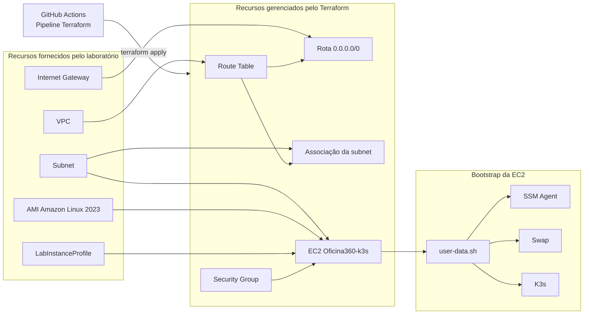

# Infraestrutura AWS com Terraform - Oficina360

## 1. Visão geral

A infraestrutura do Oficina360 é provisionada na AWS por meio do Terraform.

O objetivo é preparar uma instância EC2 capaz de executar um cluster K3s,
permitindo que a API Oficina360 e o PostgreSQL sejam implantados por meio
dos manifests Kubernetes.

O Terraform é responsável pela infraestrutura. O deploy dos workloads da
aplicação é responsabilidade da pipeline Kubernetes.

```text
Terraform
    |
    v
Infraestrutura AWS
    |
    v
EC2 com Amazon Linux 2023
    |
    v
user-data.sh
    |
    +-- SSM Agent
    +-- Swap
    +-- K3s
```

---

## 2. Responsabilidades

A automação Terraform possui as seguintes responsabilidades:

- reutilizar os recursos AWS fornecidos pelo laboratório;
- criar a tabela de rotas pública;
- criar a rota de saída para a internet;
- associar a tabela de rotas à subnet;
- criar o Security Group;
- criar a instância EC2;
- associar o Instance Profile à EC2;
- executar o `user-data.sh`;
- configurar o backend remoto do Terraform State;
- permitir criação, atualização e remoção controlada da infraestrutura.

O Terraform não aplica diretamente os manifests Kubernetes.

Depois que a infraestrutura está pronta, a pipeline Kubernetes utiliza o AWS
Systems Manager para executar o `deploy.sh` dentro da EC2.

---

## 3. Estrutura do diretório

Os arquivos estão localizados em:

```text
infra/
├── backend.tf
├── main.tf
├── network.tf
├── outputs.tf
├── provider.tf
├── security-group.tf
├── terraform.tfvars
├── user-data.sh
└── variables.tf
```

### `backend.tf`

Configura o backend remoto utilizado para armazenar o Terraform State.

### `main.tf`

Declara a instância EC2 e associa os recursos necessários, como subnet,
Security Group, Instance Profile e `user-data`.

### `network.tf`

Declara:

- Route Table pública;
- rota padrão `0.0.0.0/0`;
- associação entre a Route Table e a subnet.

### `security-group.tf`

Declara o Security Group e as regras de entrada e saída.

### `variables.tf`

Declara as variáveis utilizadas pelos arquivos Terraform.

### `terraform.tfvars`

Fornece valores para uma execução local.

Esse arquivo não deve conter credenciais AWS ou informações sensíveis.

### `outputs.tf`

Apresenta informações úteis depois do provisionamento, como:

- ID da instância;
- IP público;
- URL da API;
- ID do Security Group.

### `provider.tf`

Configura o provider AWS e a região utilizada.

### `user-data.sh`

Executa o bootstrap da EC2 no primeiro boot.

---

## 4. Arquitetura provisionada



---

## 5. Recursos fornecidos pelo laboratório

Os seguintes recursos não são criados pelo projeto:

- VPC;
- subnet;
- Internet Gateway;
- AMI Amazon Linux 2023;
- `LabInstanceProfile`.

Seus identificadores são fornecidos por variáveis Terraform.

Exemplos:

```text
TF_VAR_vpc_id
TF_VAR_subnet_id
TF_VAR_internet_gateway_id
TF_VAR_ami_id
TF_VAR_iam_instance_profile_name
```

Essa abordagem evita recriar recursos controlados pelo ambiente acadêmico.

---

## 6. Recursos gerenciados pelo Terraform

### 6.1 Route Table

O Terraform cria uma tabela de rotas pública para a subnet da EC2.

A tabela possui uma rota:

```text
Destino: 0.0.0.0/0
Próximo salto: Internet Gateway
