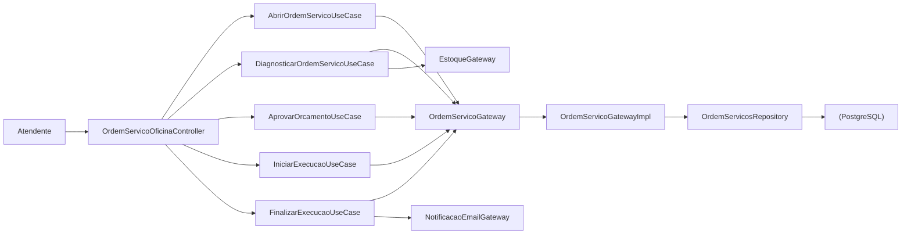

```mermaid
flowchart LR

    Usuario[Atendente]

    Controller["OrdemServicoOficinaController"]

    UC1["AbrirOrdemServicoUseCase"]

    UC2["DiagnosticarOrdemServicoUseCase"]

    UC3["AprovarOrcamentoUseCase"]

    UC4["IniciarExecucaoUseCase"]

    UC5["FinalizarExecucaoUseCase"]

    Gateway["OrdemServicoGateway"]

    EstoqueGateway["EstoqueGateway"]

    Notificacao["NotificacaoEmailGateway"]

    Adapter["OrdemServicoGatewayImpl"]

    Repo["OrdemServicosRepository"]

    Banco["(PostgreSQL)"]

    Usuario --> Controller

    Controller --> UC1
    Controller --> UC2
    Controller --> UC3
    Controller --> UC4
    Controller --> UC5

    UC1 --> Gateway
    UC2 --> Gateway
    UC2 --> EstoqueGateway

    UC3 --> Gateway

    UC4 --> Gateway

    UC5 --> Gateway
    UC5 --> Notificacao

    Gateway --> Adapter

    Adapter --> Repo

    Repo --> Banco
```