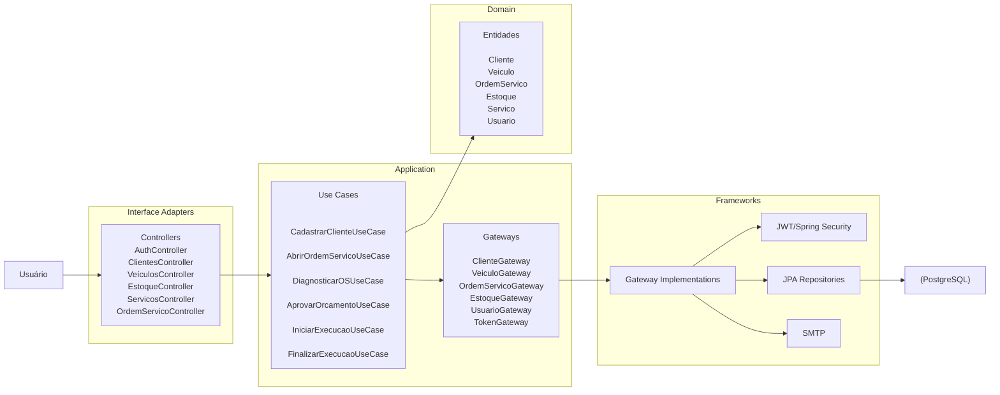

```mermaid
flowchart LR

    Usuario[Usuário]

    subgraph Interface Adapters

        Controllers["Controllers
        AuthController
        ClientesController
        VeículosController
        EstoqueController
        ServicosController
        OrdemServicoController"]

    end

    subgraph Application

        UseCases["Use Cases

        CadastrarClienteUseCase
        AbrirOrdemServicoUseCase
        DiagnosticarOSUseCase
        AprovarOrcamentoUseCase
        IniciarExecucaoUseCase
        FinalizarExecucaoUseCase"]

        Gateways["Gateways

        ClienteGateway
        VeiculoGateway
        OrdemServicoGateway
        EstoqueGateway
        UsuarioGateway
        TokenGateway"]
    end

    subgraph Domain

        Dominio["Entidades

        Cliente
        Veiculo
        OrdemServico
        Estoque
        Servico
        Usuario"]
    end

    subgraph Frameworks

        Adapters["Gateway Implementations"]

        Security["JWT/Spring Security"]

        Persistence["JPA Repositories"]

        Email["SMTP"]
    end

    Banco["(PostgreSQL)"]

    Usuario --> Controllers

    Controllers --> UseCases

    UseCases --> Dominio

    UseCases --> Gateways

    Gateways --> Adapters

    Adapters --> Persistence

    Adapters --> Security

    Adapters --> Email

    Persistence --> Banco
```