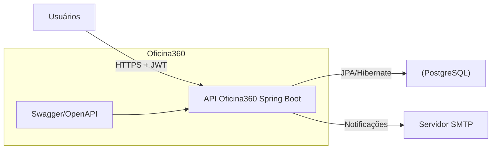

```mermaid
flowchart LR

    Cliente[Usuários]

    subgraph Oficina360

        API["API Oficina360 Spring Boot"]

        Swagger["Swagger/OpenAPI"]

    end

    Banco["(PostgreSQL)"]

    Email[Servidor SMTP]

    Cliente -->|HTTPS + JWT| API

    Swagger --> API

    API -->|JPA/Hibernate| Banco

    API -->|Notificações| Email
```